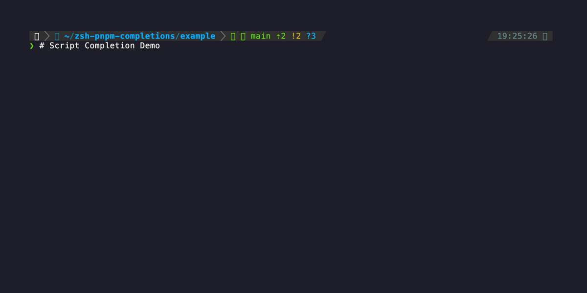

# zsh pnpm completions

> Smart pnpm completions for Z-shell with live npm search and workspace support

## ⚡ **Why This Helps**

**📝 Script Completion** - Type `pnpm run <TAB>` and instantly see all your package.json scripts. No more `cat package.json | grep scripts`.

**🔍 Live npm Search** - Type `pnpm add reac<TAB>` and get real packages from npmjs.com including `react`, `react-dom`, and related packages.

**🎯 Context-Aware** - Knows the difference between `pnpm add` (suggests new packages) and `pnpm remove` (suggests installed packages)

**📦 30+ Aliases** - Every command has a short alias: `p` = `pnpm`, `pa` = `pnpm add`, `pi` = `pnpm install`, etc.

## 🎬 **See It In Action**

**Script completion is the killer feature** - no more hunting through package.json files:



*The old way vs. the new way - TAB completion transforms your workflow!*

## 🚀 **Quick Installation**

### Option 1: npx (Recommended)

Install globally using npx:

```bash
npx zsh-pnpm-completions
```

This will automatically download and run the installer.

### Option 2: Direct Script

Copy and paste this single command to install automatically:

```bash
bash <(curl -fsSL https://raw.githubusercontent.com/michakfromparis/zsh-pnpm-completions/main/setup.sh)
```

That's it! The script will detect your zsh plugin manager and configure everything automatically.

> **Need more options?** See the [complete installation guide](docs/INSTALLATION.md) for manual installation methods.

## 🗑️ **Uninstall**

To remove the plugin from your system:

```bash
# Via npx
npx zsh-pnpm-completions --uninstall

# Or via direct script
bash <(curl -fsSL https://raw.githubusercontent.com/michakfromparis/zsh-pnpm-completions/main/setup.sh) --uninstall
```

The uninstaller will:
- Remove plugin files from your system
- Clean up configuration from `~/.zshrc`
- Remove any auto-generated configurations

After uninstalling, restart your terminal or run `source ~/.zshrc` to fully deactivate the plugin.

## 🤖 **Fully Automated Publishing**

This package is **fully automated** - just run `npm version` and everything happens automatically!

### Setup for Automated Publishing

To enable automated publishing, you need to:

1. **Create an npm account** (if you don't have one)
2. **Generate an access token**:
   ```bash
   npm login
   # Follow the prompts, then run:
   npm token create --read-only
   # Copy the generated token
   ```
3. **Add the token to GitHub**:
   - Go to your repository settings
   - Navigate to "Secrets and variables" → "Actions"
   - Click "New repository secret"
   - Name: `NPM_TOKEN`
   - Value: Paste your npm token

### Publishing a New Version (3 Simple Steps)

1. **Update the version** in `package.json`:
   ```bash
   npm version patch  # for bug fixes
   npm version minor  # for new features
   npm version major  # for breaking changes
   ```

2. **Push everything**:
   ```bash
   git push && git push --tags
   ```

3. **Watch the magic happen** ✨

**That's it!** The GitHub Action will automatically:
- ✅ Create a GitHub release with generated release notes
- ✅ Publish to npm
- ✅ Handle version conflicts safely

## 🎯 **What You Get**

* **Script completion** from your `package.json` - the killer feature
* **Live package search** from npm registry as you type
* **Smart fallback** to 50+ popular packages (React, Vue, TypeScript, Express, etc.)
* **Workspace-aware** completions via `pnpm-workspace.yaml`
* **All pnpm commands** including `dlx`, `patch`, `store`, `env`
* **Lightning-fast aliases** for every command

## 📚 **Documentation**

- **[📖 Complete Features Guide](docs/FEATURES.md)** - All aliases, supported commands, and power user features
- **[🛠️ Installation Guide](docs/INSTALLATION.md)** - Manual installation methods and troubleshooting  
- **[🎬 Demo Scripts](docs/demo/)** - How the demo gifs were created

## Contributing

Contributions are welcome! Please feel free to submit a Pull Request.

## License

MIT

## Acknowledgments

This plugin is inspired by and based on:
- [zsh-yarn-completions](https://github.com/chrisands/zsh-yarn-completions) by chrisands - The original yarn completions that served as the foundation for this plugin
- [pnpm](https://pnpm.io/) - The fast, disk space efficient package manager this plugin supports

The structure and many of the completion functions are adapted from the yarn completions project, modified to work with pnpm's command structure and features, enhanced with live npm registry search and intelligent package discovery. 